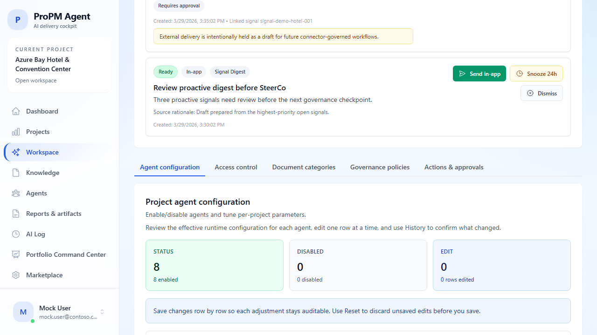

## Purpose

Agent configuration lets project administrators and other authorized project members tune how agents behave inside a single project.

- Enable or disable specific agents for a project
- Adjust runtime controls such as temperature and max tokens
- Review version history for saved changes when the current deployment exposes it

## Why this matters

Project-level governance over agents helps enforce consistent usage patterns and supports accountable AI operations.

Configuration changes affect how contextual runs behave for the project, so they should be reviewed with the same care as any other governed setting.

## Who can use it

- **View the configuration table:** project members who can open the project workspace
- **Save changes:** project members with project permission `agent:configure`
- **Open version history:** available when the current role and deployment expose configuration history

## Before you begin

- Select a project.
- Open the project workspace.
- Decide which agent you want to tune before editing multiple rows.

## What each field does

- **Status** — turns the agent on or off for the current project.
- **Temperature** — controls how deterministic or exploratory responses should be. Lower values are safer for repeatable stakeholder-facing output.
- **Max tokens** — caps output length when the deployment honors token limits for that agent.

## Steps

1. Open **Agent configuration**.
2. Review the current row values before editing. Each input shows the currently saved value below the field.
3. For one agent row, adjust any of the following:
   - **Status** (enabled/disabled)
   - **Temperature** (0 through 2)
   - **Max tokens** (whole numbers only)
4. Select **Save** on that same row.
5. If you changed a field by mistake, select **Reset** before saving.
6. (Optional) Select **History** to view saved configuration versions for that agent.

When available, also review whether the selected agent should:

- remain enabled for the project
- be limited to a narrower use case
- be tuned conservatively for stakeholder-facing output

## Expected results

- The row saves without affecting other agents.
- Invalid numeric entries are blocked before the request is sent.
- Configuration history shows versioned changes when supported by the environment.
- Updated settings apply to future runs without changing prior run history.

## Common issues

- **Save is disabled**: either you do not have `agent:configure`, nothing changed in the row, or one of the numeric values is invalid.
- **Temperature error**: use a numeric value between `0` and `2`.
- **Max tokens error**: enter a whole number greater than `0`.
- **History unavailable**: the current role or deployment may not expose configuration-history records.

## Tips

- Change one row at a time so the history stays easy to audit.
- Prefer small, auditable changes over large simultaneous parameter shifts.
- Use the demo project first if you want the fastest path to validate the UI and version-history flow.

