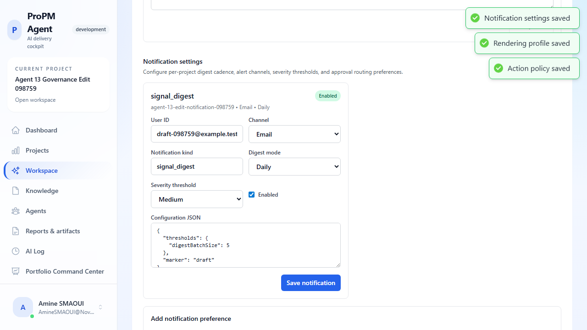
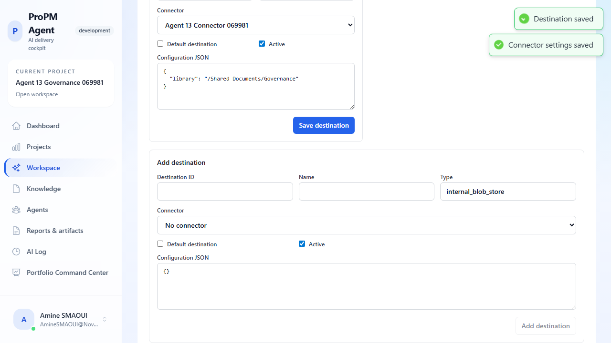

## Purpose

Use the **Governance policies** tab to decide which external systems the project can use, where governed outputs can be published, how actions are constrained, how artifacts are rendered, and which notification defaults apply.

This page is written for project administrators who need to review or change governance settings without guessing what each JSON object or field is for.

## Before you begin

- Open the relevant project workspace.
- Select the **Governance policies** tab.
- Confirm you have project settings permission. If you do not, the page stays visible in read-only mode and save controls are disabled.

## What each governance object controls

### Connectors

Connectors represent the governed external systems the project can read from or write to.

Use a connector to define:

- the external system type, such as Jira or SharePoint-backed Microsoft Graph
- whether the connector is enabled, degraded, disabled, or in error
- whether the project should treat the connector as **mock** or **live**
- the environment and fixture reference used during validation
- the scopes and authority ranking that describe how trusted the connector is
- the JSON configuration required to connect safely

### Artifact destinations

Destinations define where a governed action can publish or store an artifact.

Typical examples include:

- an internal blob store for safe default publication
- a SharePoint library for controlled business sharing

Each destination can optionally point to a connector, stay active or inactive, and be marked as the default publication target.

### Action policies

Policies define what a role may do with governed actions.

Use them to control:

- which role the policy applies to
- whether it applies to one connector or all connectors
- whether the user may only observe, draft, propose, or execute
- whether the effect is **allow**, **require approval**, or **deny**
- which scopes are permitted
- any JSON conditions, such as minimum freshness or action-type restrictions

### Rendering profiles

Rendering profiles define how governed outputs should be formatted before publication or delivery.

Use them to standardize:

- output format such as Markdown, DOCX, PDF, or HTML
- default output style for the project
- JSON styling options used by downstream publication flows

### Notification preferences

Notification preferences define the default routing and cadence for governed alerts and digests.

Use them to control:

- the channel, such as in-app, email, Teams, or webhook
- the notification kind
- digest cadence
- minimum severity threshold
- any extra routing or delivery JSON configuration

## Recommended review flow

1. Review the **supported action types** chips at the top of the page to understand what governed actions the project can use.
2. Confirm connector status, execution mode, environment, and freshness posture.
3. Review destinations to make sure publication only targets approved locations.
4. Check policies for the most sensitive action levels first, especially anything that can publish externally or execute.
5. Confirm the correct rendering profile is marked as the default.
6. Review notification defaults so escalation routes and digest cadence match the operating model.

## JSON validation and save behavior

The governance screen validates JSON fields before save.

Expect the UI to:

- keep invalid JSON fields highlighted
- show an inline validation message next to the affected field
- disable the save button for that object until the JSON is valid
- save one object at a time so changes stay easy to audit

If a save fails after validation passes, the screen shows an error toast so you can retry or capture the issue for triage.

## Example administrator workflow

1. Add or update a connector.
2. Add a destination that points to that connector.
3. Add an action policy that requires approval for sensitive actions.
4. Add or update a rendering profile for publication output.
5. Add a notification preference so the right channel receives governed alerts.

## Safe rollout pattern

For new projects, a practical rollout pattern is:

1. configure connectors in **mock** mode first
2. validate scopes, environment, and JSON configuration
3. add internal destinations before external ones
4. require approval for sensitive actions
5. switch the connector or destination to live only after the team understands the audit trail

## Read-only behavior

Users without governance edit permission should still be able to inspect current settings when the deployment exposes them, but they should not be able to change or save any record.

This is expected behavior, not a defect.

## Tips

- Keep connector and destination names business-readable so audit reviews are easier.
- Use the description field to explain why a rendering profile or connector exists.
- Treat severity thresholds and freshness constraints as trust controls, not cosmetic labels.
- Review policy changes alongside RBAC and approval responsibilities.
