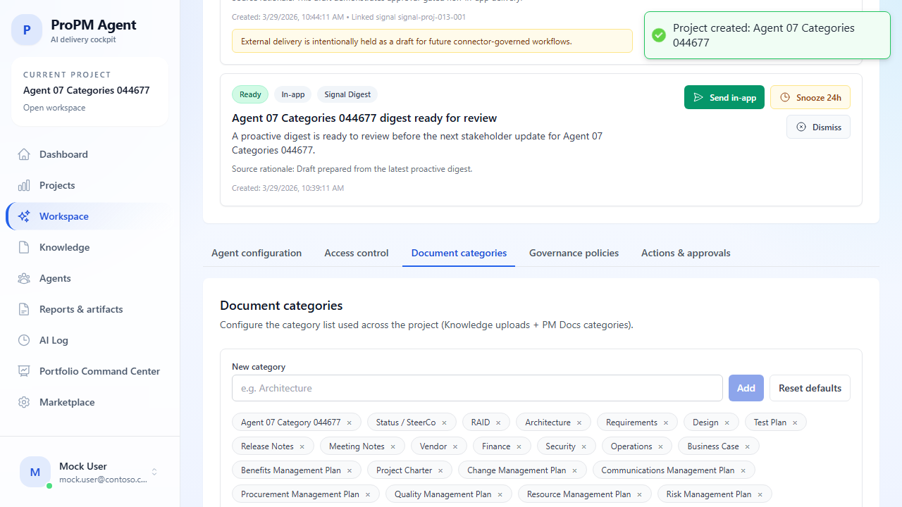

## Purpose

Document categories define the shared project taxonomy used across:

- **Knowledge** upload controls
- PM Docs category selectors and filters

## Why this matters

A stable category list makes it easier to:

- keep document filing consistent
- improve search and review habits
- keep PM Docs aligned with the same project taxonomy
- support portfolio-level comparability

## Who can change categories

- **View categories:** all project members
- **Modify categories:** users with project settings permissions, typically the **Project Owner**

If you do not have edit rights, the page stays read-only.

## Where to find it

1. Open the target project workspace.
2. Open the **Document categories** tab.

## Add a category

1. Enter a new category name.
2. Select **Add** or press **Enter**.
3. Confirm the new category appears in the category list.
4. Open **Knowledge** or **PM Docs** to verify the category is available there.

If the category already exists, the UI blocks the duplicate entry.

## Remove a category

1. Find the category pill you want to remove.
2. Select **×**.
3. Re-open **Knowledge** or **PM Docs** if needed and confirm the category is no longer offered.

## Reset categories to defaults

1. Select **Reset defaults**.
2. Confirm the standard project taxonomy returns.

Use this when ad hoc categories have drifted too far from the intended project standard.

## What changes after an update

When the category list is changed successfully:

- **Knowledge** upload category options update
- PM Docs category pickers and category filters update where the shared taxonomy is used

This propagation is project-scoped. Changing categories in one project does not change other projects.

## Recommended category practices

- keep names short and specific
- avoid duplicates with different capitalization
- prefer stable categories over one-off labels
- use document filenames or metadata for version details instead of creating a new category for every variation

## Common issues

- **Read-only state**: your role may not allow project settings changes.
- **Category not visible elsewhere yet**: refresh the target Knowledge or PM Docs page.
- **Duplicate category blocked**: the same category name already exists in the list.
