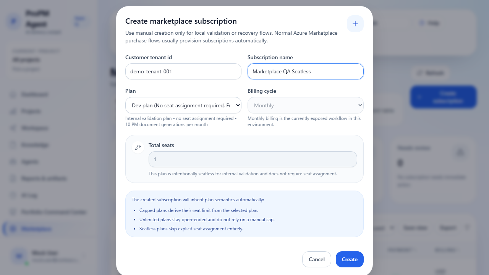

## Purpose

**Marketplace & Subscription** is the tenant-level commercial and entitlement administration area inside **Platform Administration**.

It helps authorized admins answer four practical questions quickly:

1. Which subscriptions currently exist?
2. Which plans are capped, unlimited, or intentionally seatless?
3. Are payment or fulfillment states healthy?
4. Which integrations, AI providers, and premium capabilities are enabled by the current subscription state?

## Who can use it

- **Subscription Administrator** — default editable owner for tenant-wide subscription administration
- **Delegated Platform Administrator** — editable only when explicitly granted marketplace administration rights
- **Project Administrator** — read-only only when the deployment exposes subscription context to project-facing users
- **Authenticated read-only viewer** — read-only only when exposed by the deployment

Non-admin viewers may be allowed to inspect plan, seat, and entitlement metadata, but they must not be able to change subscription settings.

## Before you begin

- Sign in with an account that has tenant-level admin visibility.
- Remember that this is a **global administration surface**, not a project-scoped page.
- In most Azure Marketplace purchase flows, subscriptions are provisioned automatically. Manual creation is primarily for operator-guided recovery, local validation, or controlled test scenarios.

## What you can do on the page

- Review subscription inventory and high-level health
- Understand whether each plan is **capped**, **unlimited**, or **seatless**
- Review payment and billing labels
- Review entitlement flags that control premium integrations or AI provider availability
- Refresh the page data without leaving the route
- Search the current subscription table
- Export the current table view to CSV when the export action is enabled
- Create a subscription manually when your environment exposes that workflow

## Read the page layout

The page should highlight the information most admins need first:

- **Summary cards** for subscription count, capped-plan seat usage, unlimited/seatless-plan count, and subscriptions that need attention
- A **refresh action** for reloading current Marketplace data
- A **Create subscription** action when manual creation is available
- A **searchable, exportable table** that shows subscription, plan, seats, entitlement, status, payment, and billing information together

## Why entitlements matter

Marketplace and subscription state affects more than billing.

It also determines whether the tenant can use:

- premium **Execution Connectors**
- premium **Ingestion Providers**
- premium ingestion modes such as scheduled or pipeline-driven import where applicable
- AI provider options that are not available on the current plan

## How the plan is resolved

The active Marketplace plan is not read from the Microsoft sign-in token.

Instead, the backend resolves the plan from the tenant's Marketplace licensing record and subscription state. This means:

- sign-in proves identity and tenant context
- the Marketplace licensing repository resolves the active plan, seat posture, and entitlement flags
- a tenant can authenticate successfully and still see read-only or restricted capabilities if the Marketplace subscription is missing, incomplete, or on a lower plan

For local development, if the signed-in tenant does not yet have a synchronized Marketplace subscription record, plan-aware capabilities may fall back to the tenant's stored licensing state or deployment defaults until Marketplace sync completes.

## Understand plan semantics

Current plans may include a mix of the following behaviors.

### Capped plans

Capped plans derive a fixed seat limit from the selected plan.

Examples:

- `pm-starter-2`
- `pm-team-15`
- `pm-business-60`
- legacy mapped plans such as `pm-team-10` or `pm-business-25`

For these plans, the UI shows seat usage in a `used / total` format plus the currently available seats.

### Unlimited plans

Unlimited plans do not expose a practical seat cap.

Example:

- `pm-unlimited`

The UI keeps assigned-seat visibility, but it does not present a hard capacity ceiling.

### Seatless plans

Seatless plans intentionally skip explicit seat assignment.

Example:

- `dev`

These plans are useful for internal validation and controlled preview scenarios. The UI explicitly labels them so admins do not waste time looking for seat controls that are not required.

## Steps

### Review current subscriptions

1. Open **Platform Administration → Marketplace & Subscription**.
2. Review the summary cards at the top of the page:
   - **Subscriptions in view**
   - **Seat usage across capped plans**
   - **Unlimited or seatless plans**
   - **Needs review**
3. Read the table row-by-row:
   - **Subscription**: friendly name plus tenant and Marketplace subscription identifier
   - **Plan**: plan name, plan description, and semantic badges such as capped, unlimited, legacy, free, or seatless
   - **Seats**: current usage and availability for managed-seat plans, or a note when seats are not required
   - **Entitlements**: premium capability flags that affect integrations or AI provider availability
   - **Status**: subscription lifecycle state such as Active, Pending, Suspended, or Cancelled
   - **Payment**: payment or billing health such as Paid, Pending, Past due, or Not applicable
   - **Billing**: current billing cycle and effective monthly price label

### Refresh Marketplace data

1. Select **Refresh**.
2. Wait for the page to reload the subscription list and plan metadata.
3. Recheck the summary cards and any rows you were reviewing.

Use this after an operator changes plan data, after a fulfillment sync completes, or after you manually create a subscription in a local/test environment.

### Search or export the subscription table

1. Use the search box above the table to narrow the list.
2. Search by any visible value, such as:
   - subscription name
   - tenant ID
   - plan name
   - status or payment label
3. If your deployment exposes export, select **Export** to download the current view as CSV.

CSV export is useful for procurement reconciliation, audit preparation, and seat-planning reviews.

### Review entitlement impact

When an integration or AI provider is unavailable, review the subscription row and entitlement summary before assuming the feature is broken.

Check whether the current plan:

- blocks premium execution connectors
- blocks premium ingestion providers
- blocks certain AI providers
- is degraded because of payment or fulfillment state

### Create a subscription manually

Only do this when your deployment or operator runbook explicitly instructs you to.

1. Select **Create subscription**.
2. Enter **Customer tenant id**.
3. Enter **Subscription name**.
4. Choose a **Plan**.
5. Review the seat guidance shown by the dialog:
   - capped plans derive their seat limit from the plan
   - unlimited plans remain open-ended
   - seatless plans skip explicit seat assignment
6. Select **Create**.
7. Confirm the new subscription appears in the Marketplace table.

## Read-only behavior

Users who are not authorized to manage marketplace administration may still be allowed to inspect:

- subscription name and plan
- seat semantics and current usage
- entitlement flags
- plan and billing status

This is expected behavior. Read-only visibility does not imply edit rights.

## Expected results

- Marketplace & Subscription is editable only for the detected subscription administrator or an explicitly delegated admin role.
- Summary cards make subscription health and capacity easier to scan.
- The subscription table clearly distinguishes capped, unlimited, and seatless plan behavior.
- Payment, status, billing, and entitlement labels are understandable without backend knowledge.
- Manual subscription creation validates correctly and adds a new row when successful.
- CSV export downloads the current table view when the action is enabled.

## Enforcement behavior and current constraints

- Seat assignment is enforced for standard capped plans.
- The `dev` plan is intentionally open-access and does not require explicit seat assignment.
- Marketplace admin endpoints remain reachable even when runtime seat enforcement is enabled.
- Actual seat enforcement outside this page is controlled by deployment configuration such as `LICENSE_ENFORCEMENT`.

## Common issues

- **Marketplace is missing from the navigation**: your current account probably lacks tenant-level admin visibility.
- **The route opens in read-only mode**: this is expected when the current user can inspect subscription state but cannot administer it.
- **The route opens but shows Access Denied**: the current session is authenticated, but the deployment does not expose marketplace visibility to your role.
- **Create subscription fails**: verify tenant ID, plan selection, and subscription name, then retry.
- **Seat count input is disabled**: this is expected for capped, unlimited, or seatless plans whose behavior is derived from the selected plan.
- **The list looks stale after a plan or fulfillment update**: use **Refresh** and then reload the table view.

## Tips

- Treat Marketplace & Subscription as the source of truth for subscription semantics and entitlement posture.
- Use the summary cards first when you need a fast health check before a customer review.
- Use CSV export before procurement or billing meetings so the current state is preserved outside the app.
- If a plan is labeled seatless or unlimited, do not expect the same seat-management behavior as a capped plan.
- If an integration or AI provider is blocked, verify plan and entitlement state before opening a support incident.
