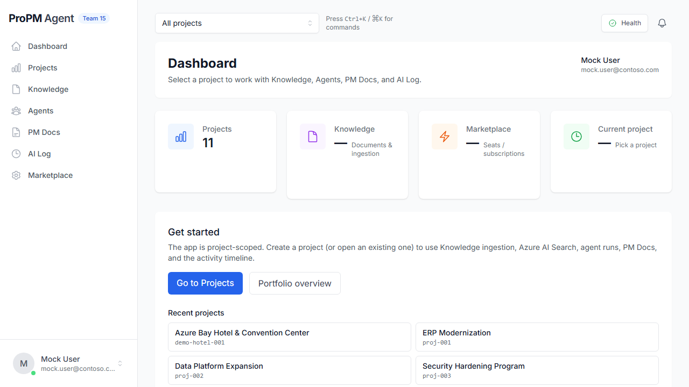

ProPM Agent helps project teams, PMOs, and tenant administrators run **project workspaces** with:

- **Context-aware execution** with project, user, activity, and tool context assembled before an agent responds
- **Evidence-backed outputs** with visible citations, freshness states, assumptions, missing information, and confidence
- **Governed artifacts** with draft, diff, approval, publication, and lineage across reports and PM Docs
- **Proactive signals** for staleness, contradictions, follow-up gaps, and connector health
- **Portfolio comparison** across selected projects using configurable signals instead of fixed dashboards
- **Governed connectors** that can enrich context from external systems while keeping actions approval-gated and auditable

These docs are written for **business users** and **tenant administrators** who deploy ProPM Agent from **Azure Marketplace**.

## Start here

If you are new to ProPM Agent, use this order:

1. Sign in and let the root URL redirect you to **Dashboard**.
2. Confirm your current context in the **top bar** and **shell project context** panel.
3. Open **Projects** to choose or create the project you want to work in.
4. Return to **Dashboard** to review readiness, recent activity, and recommended next steps.
5. Move into **Workspace**, **Knowledge**, **Agents**, **PM Docs**, or **AI Log** from the left navigation once the correct project is active.

## What you can do with ProPM Agent

- Create and browse projects
- Upload project documents and search them through Azure AI Search-backed retrieval
- Chat with specialized agents and review structured outputs in project context
- Inspect evidence freshness, contradictions, confidence, and trace metadata before acting on outputs
- Turn responses into editable artifacts, review diffs, and publish approved versions
- Review proactive signals, generate digest drafts, and keep follow-up actions traceable
- Compare selected projects with configurable portfolio signals and evidence-backed drill-down
- Review AI runs, artifact lineage, and project activity for audit-friendly visibility
- Manage project membership and roles (Project Owner)
- Configure project document categories, agent settings, connectors, policies, and notification preferences (Project Owner / admin)

## How the product is organized

ProPM Agent is **project-scoped**:

1. You select a project.
2. You upload knowledge and run agents in that project context.
3. The platform keeps evidence, freshness, actions, approvals, and outputs attached to that project.
4. Portfolio comparison works by selecting multiple projects explicitly; it does not bypass normal project visibility.

The application shell has two navigation layers:

- The **left sidebar** is your persistent route map for Dashboard, Projects, Workspace, Knowledge, Agents, PM Docs, AI Log, Portfolio Command Center, and Marketplace when your role allows it.
- The **top bar** keeps your active project, command palette entry point, notifications, health diagnostics, language, theme, and help controls visible without leaving the page you are on.

## What is different in the target-state experience

- The agent does not start from only a prompt. It starts from contextual project state.
- The default response is not only narrative text. It is a structured output with evidence and confidence cues.
- Artifacts are governed business objects with traceable lineage.
- Proactive assistance is visible and suppressible rather than hidden automation.
- External system usage remains read-first and approval-gated.
- The product remains methodology-neutral: it helps teams work with their own operating model instead of forcing a fixed template set.

## Demo readiness

- All published demo scenarios use **synthetic, non-sensitive data**.
- The fastest guided walkthrough uses the seeded project **Azure Bay Hotel & Convention Center** (`demo-hotel-001`).
- Multi-project comparison scenarios also include seeded projects such as **ERP Modernization**, **Data Platform Expansion**, and **Contact Center Upgrade**.

## Support & contact

For support or commercial inquiries, contact us at:

- **NovaBiz**
- 131 Continental Dr, Suite 305
- Newark, DE 19713 · United States
- [support@navabiz.pro](mailto:support@navabiz.pro)

## Next

Start with **Get started → Quick start** to go from sign-in to your first contextual run, structured output review, and demo walkthrough.

