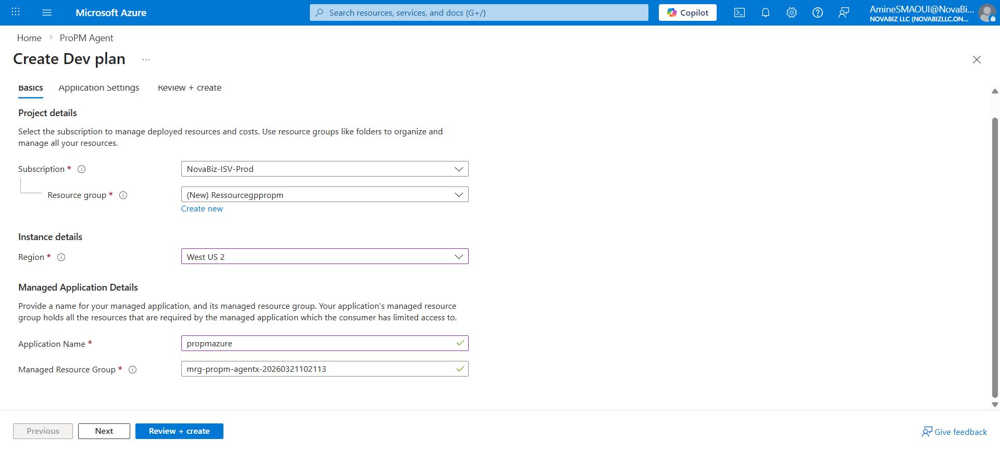
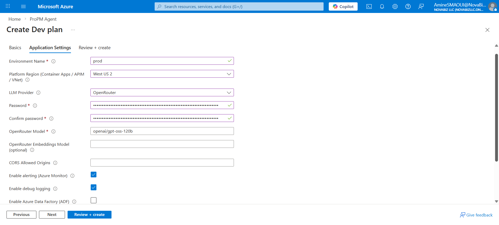
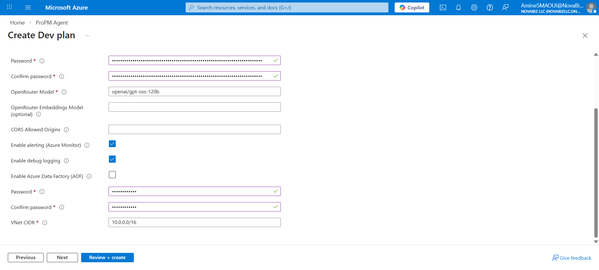
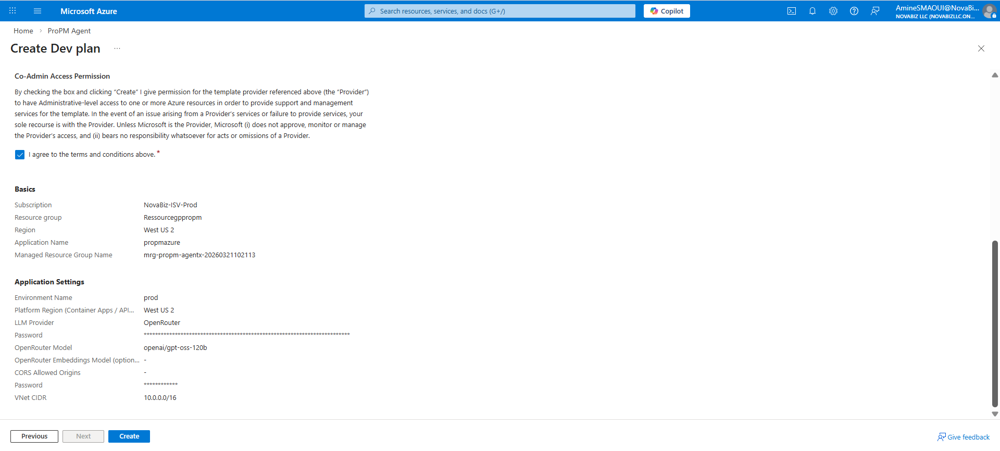

This page walks a tenant admin through deploying ProPM Agent from Azure Marketplace.

Recent deployment work has made installation easier by automating runtime configuration, regional platform placement controls, publisher-managed Entra sign-in wiring, and optional Azure OpenAI deployment.

The screenshots below reflect the current Azure Portal deployment experience for the Marketplace offer.

## Who can do this

- **Tenant Admin / Installer**

## Before you begin

Complete the checklist in **Install via Azure Marketplace → Prerequisites**.

## Step 1 — Open the offer

1. In Azure Portal, open the **ProPM Agent** offer in **Azure Marketplace**.
2. Select **Create**.

## Step 2 — Complete the Basics tab

In **Basics**, select or enter:

- **Subscription**
- **Resource group**
- **Region**
- **Application Name**
- **Managed Resource Group**

The **Region** on this first tab is the Managed Application deployment region. Keep it aligned with your organizational standards and available quotas.

## Step 3 — Complete the Application Settings tab

The **Application Settings** tab contains the environment, platform, provider, and database inputs used by the deployment.

### Core fields

- **Environment Name** — a short environment label such as `dev`, `test`, or `prod`
- **Platform Region (Container Apps / APIM / VNet)** — the region used for the VNet-based application platform
- **LLM Provider** — choose one of the supported providers
- **CORS Allowed Origins** — optional; usually left empty unless you are allowing additional web origins
- **Enable alerting (Azure Monitor)** — optional monitoring integration
- **Enable debug logging** — optional diagnostic logging for rollout and support
- **Enable Azure Data Factory (ADF)** — optional integration toggle
- **Azure SQL Admin Password** — a strong password for initial SQL provisioning
- **VNet CIDR** — an unused private address range for the deployment network

If one platform region is unavailable due to quota or temporary capacity limits, choose another supported platform region such as `eastus2`, `centralus`, `westeurope`, or `northeurope`.

### Identity behavior during installation

In the default model, no customer-owned Entra application needs to be created or entered during deployment.

The installation uses the publisher-managed shared application and then restricts sign-in to the purchasing tenant. Tenant admin consent still happens after deployment from the sign-in screen.

### Select the LLM provider

Choose one of the four supported options:

- **Azure OpenAI (deploy during installation)**
- **Azure OpenAI (customer-managed)**
- **OpenAI-compatible endpoint**
- **OpenRouter**

The wizard reveals different provider-specific fields depending on the option you select.

### Provider-specific inputs

Use the provider-specific fields shown by the wizard:

- **Azure OpenAI (deploy during installation)**
  - no pre-existing endpoint is required
  - use this when you want the Managed Application deployment to provision Azure OpenAI for you
- **Azure OpenAI (customer-managed)**
  - provide the **Azure OpenAI Endpoint**
  - provide the **chat/completions deployment name**
  - optionally provide an **embeddings deployment name**
  - optionally provide an **API key** if you are not using managed identity / Entra auth
- **OpenAI-compatible endpoint**
  - provide the **base URL**
  - provide the **model name**
  - optionally provide an **API key**
  - optionally provide an **embeddings model name**
- **OpenRouter**
  - provide the **OpenRouter API key**
  - provide the **OpenRouter model**
  - optionally provide an **OpenRouter embeddings model**

When a provider requires a secret, the current wizard may render it as a masked password-style input. Enter the prepared provider key carefully, then continue with the model and network values.

The following example shows an **OpenRouter** configuration with the provider selected, the model entered, alerting enabled, and debug logging enabled.

The lower part of the same tab includes the remaining optional toggles, the SQL admin password fields, and the VNet CIDR.

## Step 4 — Review and create

1. Select **Review + create**.
2. Wait for Azure validation to complete.
3. Review the effective values for the Basics and Application Settings tabs.
4. Confirm the co-admin permission notice.
5. Select **Create**.

## Step 5 — Wait for deployment completion

Wait for the Marketplace deployment to finish provisioning the Managed Application and its underlying resources.

After deployment succeeds, continue with **Post-deployment — find the app URL and sign in**.

## What is now handled automatically

The current deployment flow automates the following tasks for you:

- frontend runtime configuration (`/runtime-config.json`)
- API base URL and runtime auth settings injection
- publisher-managed shared auth configuration injection
- provider-specific LLM configuration injection for Azure OpenAI (managed or customer-managed), OpenAI-compatible endpoints, or OpenRouter
- optional Azure OpenAI account + deployments when `azure-openai-managed` is selected
- tenant restriction enforcement in APIM and API
- deployment guardrails that stop the installation if sign-in would otherwise be broken

## Expected results

After deployment completes, you can open the Managed Application resource and find the web application URL and effective runtime outputs.

In the supported identity flow, sign-in should work after the tenant admin grants consent to the shared publisher app.

## Common issues

- **Deployment fails due to networking**: confirm the **VNet CIDR** does not overlap with existing address ranges.
- **You are unsure which password fields belong to which service**: provider secrets appear with the selected LLM provider, while the lower password fields are used for Azure SQL provisioning.
- **Tenant admin cannot complete sign-in**: confirm the shared app contains the configured callback URI and that the consent button is used at least once.
- **Deployment fails because of regional quota/capacity**: redeploy with a different **Platform Region (Container Apps / APIM / VNet)**.

