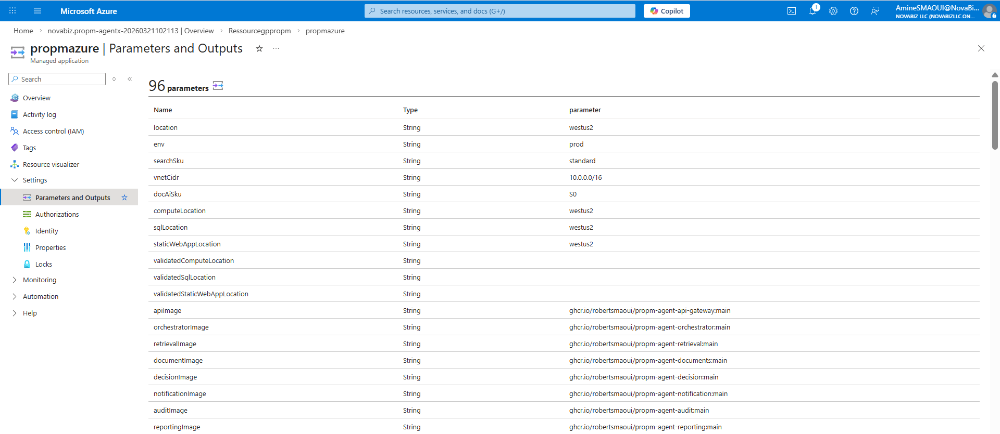
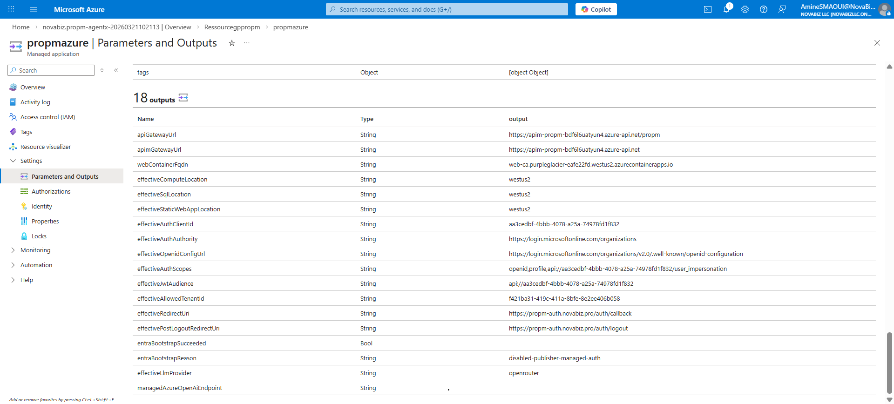

Once the Marketplace deployment finishes, you can access ProPM Agent and verify the effective deployment outputs.

## Who can do this

- **Tenant Admin / Installer**
- **Project Owner / Project Manager / Contributor / Viewer / Auditor** (sign-in)

## Steps

1. In Azure Portal, open the **Managed Application** resource created by the deployment.
2. In the left navigation, open **Settings → Parameters and Outputs**.
3. Review the deployed parameters and outputs.

4. Locate the web entry point:
   - use **webContainerFqdn** if the portal shows a hostname only
   - use **apiGatewayUrl** or **apimGatewayUrl** when you need to confirm the backend endpoints
5. Open the web application in a browser. If you copied **webContainerFqdn**, open it as `https://<webContainerFqdn>`.
6. If you are the tenant admin, first select **Tenant Admin: Grant Microsoft consent**.
7. Then select **Sign In with Microsoft**.
8. After sign-in, review **Platform Administration** if your role allows it to confirm the deployment-selected AI provider and current subscription administration state.

## Outputs to verify after deployment

The outputs page provides the quickest way to confirm that installation values were applied correctly.

Check these outputs in particular:

- **webContainerFqdn** — frontend hostname to open in the browser
- **apiGatewayUrl** / **apimGatewayUrl** — backend endpoint values exposed by the deployment
- **effectiveAuthClientId** — the client ID injected into the frontend runtime configuration
- **effectiveAuthAuthority** — the Microsoft identity authority used by the deployment
- **effectiveAuthScopes** — scopes requested during sign-in
- **effectiveAllowedTenantId** — the tenant restriction enforced by the installation
- **effectiveRedirectUri** — redirect URI expected by the shared publisher-managed authentication flow
- **effectivePostLogoutRedirectUri** — post-logout URI expected by the shared publisher-managed authentication flow
- **effectiveLlmProvider** — the deployment-selected AI provider selected for the environment

If any of these values do not match your intended deployment, stop and investigate before onboarding users.

## Deployment-selected versus effective AI provider

The deployment output shows the provider selected during installation.

After deployment:

- that provider should appear in **AI Provider Settings** as the deployment-selected value
- the current effective provider should also be visible in admin
- an authorized admin may be able to change the effective provider later if policy allows

## What should already be configured automatically

In the current deployment flow, the following should already be aligned by deployment time:

- frontend runtime auth configuration
- API and APIM auth settings
- effective client ID, authority, and scopes
- stable publisher callback URI placeholder and allowed tenant restriction

That means a normal installation should not require the customer to create an app registration manually.

## Expected results

- You can sign in successfully.
- You land on the **Dashboard**.
- The Managed Application outputs reflect the tenant, redirect URI, AI provider, and endpoint values selected during deployment.
- Authorized admins can later verify that the deployment-selected provider is surfaced correctly in **Platform Administration**.

## Verify access quickly

After sign-in, try one simple action:

1. Open **Projects**.
2. Confirm you can see at least one project or (if you are a Project Owner) that you can create one.
3. Optionally confirm the frontend can reach the API by opening a normal working page such as **Dashboard**, **Projects**, or **Knowledge**.

## Common issues

- **You can’t sign in**: confirm the shared Entra app contains `https://propm-auth.novabiz.pro/auth/callback` and that the callback domain is live.
- **The portal shows only a hostname and not a clickable URL**: use `https://<webContainerFqdn>` in the browser.
- **The runtime values look wrong in Azure Portal**: compare **effectiveAuthClientId**, **effectiveRedirectUri**, **effectiveAllowedTenantId**, and **effectiveLlmProvider** against the values you intended to deploy.
- **Access denied after sign-in**: confirm your account has been assigned the appropriate ProPM Agent role in Entra ID.
- **You are blocked after successful sign-in**: confirm you are signing in from the tenant that purchased the installation; tenant ID is enforced by APIM and the API.

