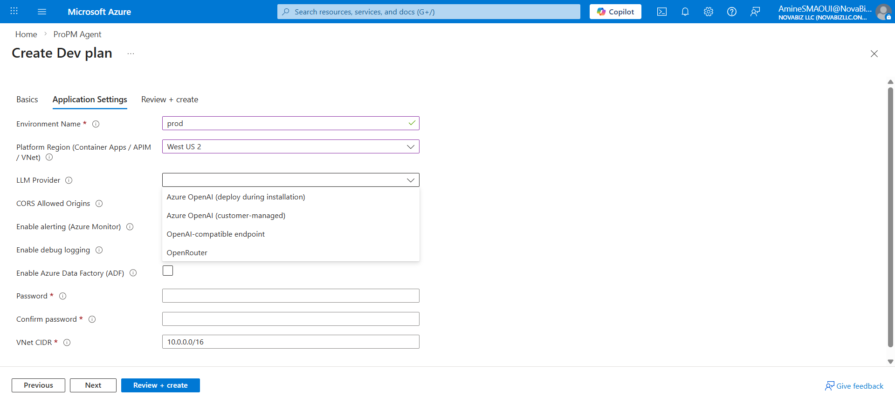

Before you deploy ProPM Agent from Azure Marketplace, confirm you have the following.

This checklist is written to match the current Azure Marketplace deployment wizard and the deployment screens used in the installation walkthrough.

## Deployment experience improvements

Recent deployment hardening work makes installation easier and safer:

- platform-region selection for the VNet-based application stack
- automatic runtime configuration for the frontend and API endpoints
- publisher-managed shared Entra authentication wiring
- fail-fast deployment guardrails so the installation cannot complete with broken sign-in settings

## Azure subscription and permissions

- An Azure subscription where you are allowed to deploy **Managed Applications**.
- Permission to select or create a **resource group**.
- Permission to deploy into a supported **region**.

## Identity (Microsoft Entra ID)

The deployment now uses a publisher-managed shared Entra application.

You do **not** need to create a customer-owned app registration before deployment.

You do need:
- a valid purchasing tenant
- a tenant admin who can grant consent after deployment
- a publisher-controlled stable callback domain configured on the shared app

## Network plan

- A **virtual network CIDR range** available for the deployment.
  - Use a non-overlapping private CIDR range.
  - If you are unsure, coordinate with your network team.

## AI model configuration

Choose one LLM provider model:

### Option A — Azure OpenAI (deploy during installation)

- no pre-existing endpoint is required
- confirm Azure OpenAI is supported and quota is available in the target region

### Option B — Azure OpenAI (customer-managed)

- An existing **Azure OpenAI endpoint**
- The **deployment name** used for chat/completions
- Optionally, a separate **embeddings deployment name**
- Optionally, an **API key** if you are not using managed identity / Entra auth from the deployment

### Option C — OpenAI-compatible endpoint

- The **base URL** of the compatible endpoint
- The **model name** to use
- Optionally, an **API key** if the endpoint requires one
- Optionally, a separate **embeddings model name**

### Option D — OpenRouter

- An **OpenRouter API key**
- The **OpenRouter model ID** you want the deployment to use
- Optionally, a separate **OpenRouter embeddings model**

The Marketplace wizard prompts you to choose the provider before it reveals the provider-specific inputs.

## Database provisioning input

- A strong **Azure SQL admin password** (minimum 12 characters).

## Optional: CORS origins (only if needed)

- If you plan to access the API from additional web origins (for example, custom domains), prepare the list of allowed origins.

## What you will provide during deployment

You will be asked for these values in the Marketplace deployment wizard:

- **Basics tab**
  - **Subscription**
  - **Resource group**
  - **Region**
  - **Application Name**
  - **Managed Resource Group**
- **Application Settings tab**
  - **Environment Name**
  - **Platform Region (Container Apps / APIM / VNet)**
  - **LLM Provider**
  - provider-specific values such as **Azure OpenAI endpoint**, **OpenAI-compatible base URL**, or **OpenRouter API key and model**
  - **CORS Allowed Origins** (optional)
  - **Enable alerting (Azure Monitor)** (optional)
  - **Enable debug logging** (optional)
  - **Enable Azure Data Factory (ADF)** (optional)
  - **Azure SQL Admin Password**
  - **VNet CIDR**
- **Identity flow**
  - no customer-owned Entra app inputs in the default deployment model
  - tenant admin consent after deployment on first sign-in

If you select a provider that requires a secret, the wizard may show that secret as a masked password-style field. Prepare the correct key values before opening the form so you can complete the wizard without interruption.

