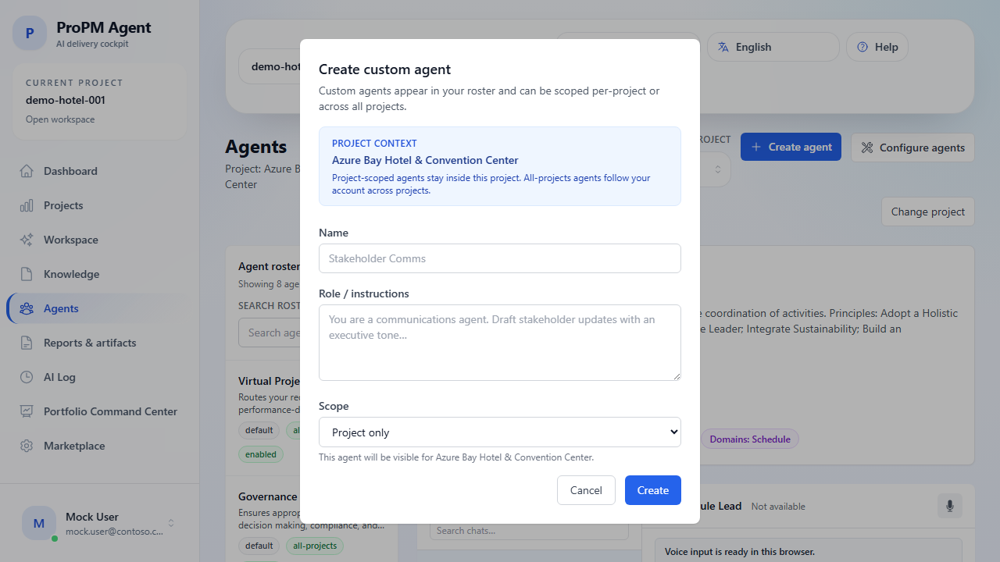

## Purpose

**Agents** is the project AI console. It brings together four things in one place:

- a project picker when no project is active
- the agent roster for the current project
- the live chat surface for the selected agent
- custom-agent creation and cleanup for authorized users

## Why this matters

Agents convert project context into structured outputs (risk summaries, plans, governance notes, stakeholder updates) while keeping interactions traceable.

## Who can use it

- **View agent roster:** all project members
- **Run chat prompts:** Project Owner, Project Manager, Contributor
- **Create/Delete custom agents:** Project Owner

## Before you begin

- Select a project. If you open **Agents** without project context, use the page-level project picker or the available-projects table first.
- Recommended: upload or seed relevant documents in **Knowledge** for better context grounding.
- For demos, choose **Azure Bay Hotel & Convention Center** (`demo-hotel-001`) to use pre-seeded conversations, pre-seeded AI runs, and the fastest end-to-end validation path.

## Steps

### Open Agents for a project

1. Open **Agents** from the left navigation.
2. If no project is active, use the page-level **Project picker** or click a row in **Available projects**.
3. Confirm the header shows the current project before starting a chat.

### Change project context without leaving Agents

1. Use the **Current project** switcher in the page header.
2. Choose a different project.
3. Confirm the agent summary card updates to the new project context.

### Run a chat prompt

1. Select an agent in the roster on the left.
2. Use **Search roster** if you already know the specialist you want.
3. Review the selected-agent summary card to confirm:
   - kind
   - scope
   - status
   - covered domains
4. Enter prompt text in the message box.
5. Click **Send**.
6. Review the structured response sections and references.
7. Note any evidence freshness, missing information, or confidence cues before reusing the output.

### Review contextual response guidance

After a run completes, look for:

- decisions needed
- recommended actions
- assumptions
- missing information
- evidence references
- freshness badges
- artifact proposals

This makes it easier to decide whether the answer is ready for direct use, needs clarification, or should be turned into a draft artifact for review.

### Demonstrate saved chat sessions (demo)

1. Open the demo hotel project.
2. Select seeded chat sessions in the history panel.
3. Create a **New** chat, send a fresh prompt, then switch back to a seeded session.
4. Confirm previous messages remain available.

### Understand read-only behavior

If you are not a **Project Owner**, the page shows a read-only notice. You can still:

- browse the roster
- switch among enabled agents
- run chats

You cannot create, delete, or reconfigure agents from that state.

### Manage custom agents (Project Owner)

1. Click **Create agent**.
2. Review the **Project context** panel in the dialog.
3. Enter a clear **Name**.
4. Add **Role / instructions** that describe tone, output shape, and required checks.
5. Choose **Project only** unless your environment explicitly exposes a wider scope.
6. Select **Create**.
7. Confirm the new agent appears in the roster and can be selected like a built-in agent.
8. Use the delete icon when cleanup is needed.

## Expected results

- Opening **Agents** without a project gives you clear project-picking guidance instead of a dead end.
- The page stays project-aware when you switch context from the header picker.
- Agent responses are returned successfully.
- Runs are visible later in **AI Log**.
- Structured outputs make evidence, freshness, and confidence visible when available.
- Custom agents appear/disappear according to create/delete actions.
- Seeded demo chats are available and can be switched without losing message history.

## Common issues

- **Read-only behavior**: your role can run agents but cannot manage custom agents or configuration.
- **Agent shows Offline**: transient status; retry prompt or refresh.
- **Roster refresh warning**: the page may keep showing the last available roster while the latest refresh is retried.
- **Voice input unavailable**: browser does not support speech recognition APIs.
- **All-projects scope missing**: some live environments expose only project-scoped custom agents.

## Tips

- Start with **Virtual Project Manager** when uncertain which specialist to invoke.
- Use specialist agents for focused outputs (Risk, Schedule, Governance, Finance, Stakeholders).
- Prompt with expected format (table, bullet list, decision log) to reduce manual rewriting.
- Use the roster search before scrolling through the full list.
- If a response shows stale, unavailable, or conflicting evidence, review sources before approving or publishing the result.

