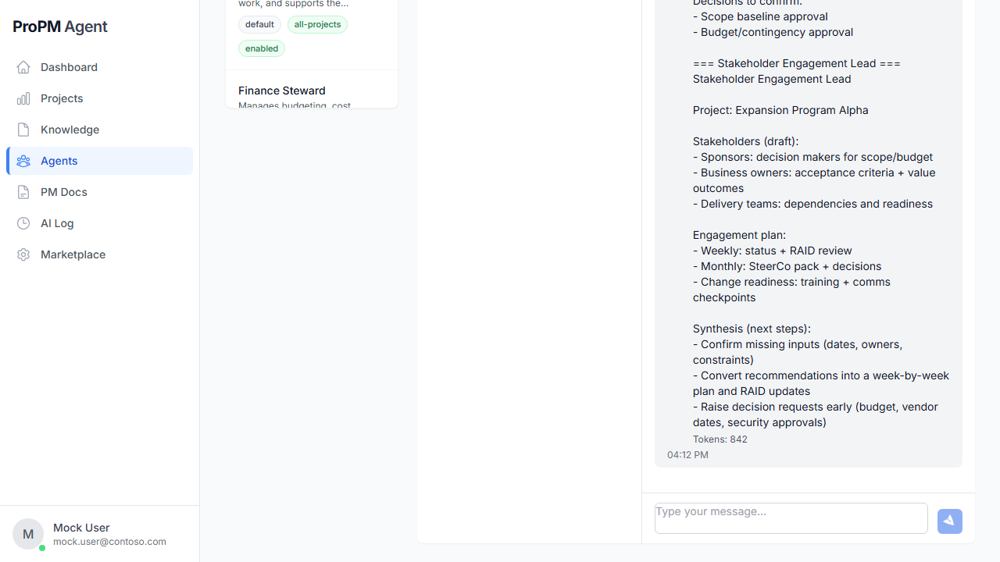

## Purpose

**Agents** is the project AI console. It provides the agent roster, chat execution area, and custom-agent lifecycle (creation/deletion for authorized users).

## Why this matters

Agents convert project context into structured outputs (risk summaries, plans, governance notes, stakeholder updates) while keeping interactions traceable.

## Who can use it

- **View agent roster:** all project members
- **Run chat prompts:** Project Owner, Project Manager, Contributor
- **Create/Delete custom agents:** Project Owner, or any signed-in user inside the default demo project

## Before you begin

- Select a project.
- Recommended: upload or seed relevant documents in **Knowledge** for better context grounding.
- For demos, choose **Azure Bay Hotel & Convention Center** (`demo-hotel-001`) to use pre-seeded conversations, pre-seeded AI runs, and default full admin rights.

## Steps

### Open Agents for a project

1. Open **Agents** from the left navigation.
2. If no project is active, choose one first.

### Run a chat prompt

1. Select an agent in the roster (left panel).
2. Enter prompt text in the message box.
3. Click **Send**.
4. Review the structured response sections and references.
5. Note any evidence freshness, missing information, or confidence cues before reusing the output.

### Review contextual response guidance

After a run completes, look for:

- decisions needed
- recommended actions
- assumptions
- missing information
- evidence references
- freshness badges
- artifact proposals

This makes it easier to decide whether the answer is ready for direct use, needs clarification, or should be turned into a draft artifact for review.

### Demonstrate saved chat sessions (demo)

1. Open the demo hotel project.
2. Select seeded chat sessions in the history panel.
3. Create a **New** chat, send a fresh prompt, then switch back to a seeded session.
4. Confirm previous messages remain available.

### Manage custom agents (Project Owner)

1. Click **Create agent**.
2. Provide name, role/instructions, and scope.
3. Save, then validate it appears in roster.
4. Use delete action when cleanup is needed.

In the default demo project, any signed-in user can test custom-agent creation and deletion without additional role setup.

## Expected results

- Agent responses are returned successfully.
- Runs are visible later in **AI Log**.
- Structured outputs make evidence, freshness, and confidence visible when available.
- Custom agents appear/disappear according to create/delete actions.
- Seeded demo chats are available and can be switched without losing message history.
- Seeded and newly generated runs coexist in the AI Log for a complete walkthrough storyline.

## Common issues

- **Read-only behavior**: user role lacks edit permissions.
- **Agent shows Offline**: transient status; retry prompt or refresh.
- **Voice input unavailable**: browser does not support speech recognition APIs.

## Tips

- Start with **Virtual Project Manager** when uncertain which specialist to invoke.
- Use specialist agents for focused outputs (Risk, Schedule, Governance, Finance, Stakeholders).
- Prompt with expected format (table, bullet list, decision log) to reduce manual rewriting.
- If a response shows stale, unavailable, or conflicting evidence, review sources before approving or publishing the result.

