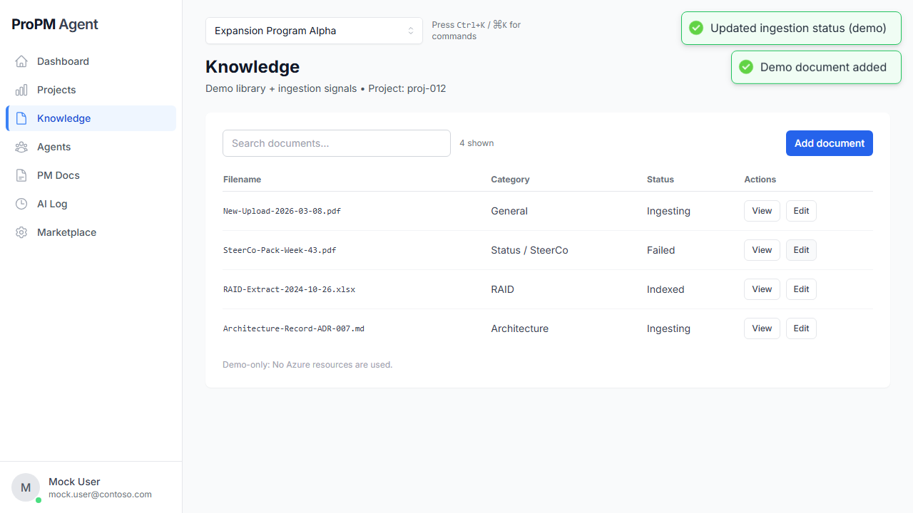
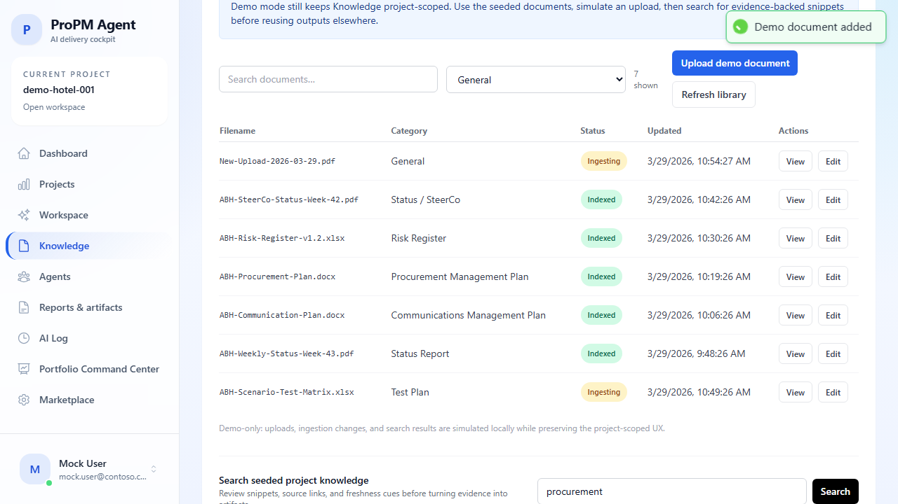
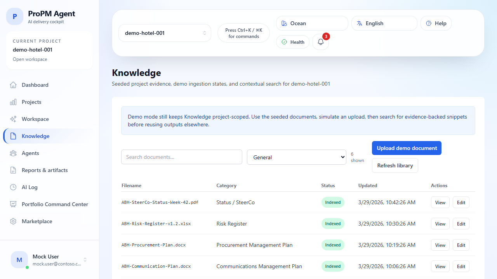

## Purpose

**Knowledge** is the project-scoped document hub for uploads, ingestion tracking, retrieval, and evidence-backed search.

Use it to:

- upload documents into the current project boundary
- review ingestion and indexing status
- search the project knowledge base with snippets and source references
- confirm what evidence is fresh enough to reuse in PM Docs, workspace outputs, and approvals

## Before you begin

1. Open or select the project you want to work in.
2. Confirm you are on the correct project before uploading or searching.
3. If your team uses a category taxonomy, review the configured categories first.

## What you can do in Knowledge

### 1. Upload a document

1. Open **Knowledge**.
2. Confirm the project shown at the top of the page.
3. Choose an **Upload category**.
4. Select a file from your computer.
5. Select **Upload**.
6. Select **Refresh** if you need to re-check the latest ingestion status.

The document list refreshes inside the current project only.

### 2. Import from an approved source

If your project has approved **Ingestion Providers**, **Knowledge** can import from them without exposing technical setup.

1. Open **Knowledge**.
2. Select **Import from source**.
3. Review the available sources.
4. Choose the source you want to use.
5. If prompted, enter only safe operational inputs such as category, date range, or import scope already allowed for that project binding.
6. Start the import and review the resulting history entry.

The import picker should show business-friendly information such as:

- source name
- source label such as `sharepoint`, `adf`, `blob`, or `confluence`
- last import time
- freshness or health state
- a blocker explanation when the source is not currently usable

### 3. Review ingestion status

Each document row shows the most useful operational metadata the UI can surface, including:

- filename
- category
- file type
- size
- ingestion status
- latest visible timestamp
- source label when the document came from an approved imported source

Typical statuses are:

- **Indexed**: ready for search
- **Ingesting**: uploaded, but not yet fully indexed
- **Failed**: ingestion or indexing did not finish successfully

If a document is not yet searchable, wait for it to progress to an indexed or ready-style status.

### 4. Review import history

When the deployment exposes import history, use it to confirm:

- provider display name
- started and completed time
- import mode
- discovered, imported, skipped, and failed counts
- freshness summary
- sanitized failure summary when applicable

### 5. Search project knowledge

1. Enter a keyword, phrase, or question in **Search**.
2. Select **Search**.
3. Review the returned evidence:
   - snippet text
   - source link into Knowledge or the connected source
   - optional page or section metadata
   - freshness badge when available
   - source-system metadata when available
   - provenance labels that identify whether the evidence came from a managed imported source or a manual upload

Use the source link before reusing the evidence in stakeholder outputs.

### 6. Validate seeded demo knowledge

In the default demo project `demo-hotel-001`, Knowledge starts with seeded documents so you can test the flow immediately.

Recommended demo searches include:

- `SteerCo`
- `procurement`
- `communication`
- `chiller`

The seeded demo flow is useful for validating:

- search result structure
- ingestion-state rendering
- category coverage
- freshness and evidence cues

## Document categories and propagation

Knowledge upload categories come from the project-level **Document categories** settings in the Workspace.

When a project owner updates the category list:

- the **Knowledge** upload category picker updates
- PM Docs category selectors and filters update where the category taxonomy is used

See the admin guide: [Document categories](../administration/document-categories.md)

## Supported file types

By default, the system can extract and index content from:

- **PDF**
- **DOCX**
- **XLSX**
- **CSV**
- **HTML / HTM**
- **Images** through OCR when the extraction services are enabled

Extraction can also depend on deployment flags such as:

- `ENABLE_EXTRACT_XLSX`
- `ENABLE_EXTRACT_CSV`
- `ENABLE_EXTRACT_HTML`

## Supported source labels

Imported and manually uploaded content should use clear provenance labels such as:

- `manual`
- `adf`
- `sharepoint`
- `blob`
- `confluence`
- `jira`
- `sftp`
- `ms_project`
- `smartsheet`
- `wrike`
- `asta_powerproject`

These labels help users understand where evidence came from without reading backend configuration.

## Azure Data Factory (ADF) batch import

Use ADF when an operator needs to move documents from an external system into the standard product ingestion path.

High-level flow:

1. Source system or file feed
2. Staging blob
3. Documents API handoff
4. Ingestion and indexing
5. Searchable result inside **Knowledge**

Operator runbook: [ADF batch-ingestion runbook](https://github.com/robertsmaoui/ProPM-Agent/blob/main/repo/adf/README.md)

After an ADF run, validate the user-visible outcome in the product:

1. Open the target project in **Knowledge**.
2. Confirm the imported document appears in the list.
3. Wait until the document reaches an indexed or ready state.
4. Search for a unique keyword from that file.
5. Confirm the search result shows a snippet and a source reference.

If direct ADF execution is not available in your environment, stage an equivalent imported document through the documented ingestion path and still verify the same downstream user-facing behavior in Knowledge.

## Evidence review checklist

Before using Knowledge evidence in a stakeholder output:

1. Open the cited source.
2. Confirm the snippet matches the claim.
3. Check freshness badges and timestamps.
4. Treat stale, conflicting, or unavailable evidence as a review signal.
5. Re-run search after the document reaches an indexed state if needed.

## Permissions and read-only behavior

Depending on your project role:

- some users can view and search only
- some users can upload and refresh
- some users can review import history but not trigger imports
- restricted users may see read-only guidance for upload or search actions

If a control is disabled, your role may not allow that action in the current project.

## Common issues

- **Document not searchable yet**: the document may still be ingesting or indexing.
- **Upload is disabled**: your role may not have upload rights in the current project.
- **Import from source is unavailable**: the project may not have an approved ingestion provider, the provider may be unhealthy, or your role may not allow running imports.
- **Search is disabled or fails**: retry, then capture the trace ID if one is shown.
- **Source link is internal instead of external**: use the in-app source shortcut to jump to the document row inside the app when the source system does not expose a direct file URL.

## Tips

- Keep category names short and stable so Knowledge and PM Docs stay aligned.
- Use filenames with dates or versions when you want easier evidence tracing.
- Re-check the current project before uploading to avoid putting files into the wrong project boundary.
- Use import history to confirm managed source freshness before relying on evidence for a stakeholder decision.
- Use Knowledge search as a verification step, not just a retrieval shortcut.
