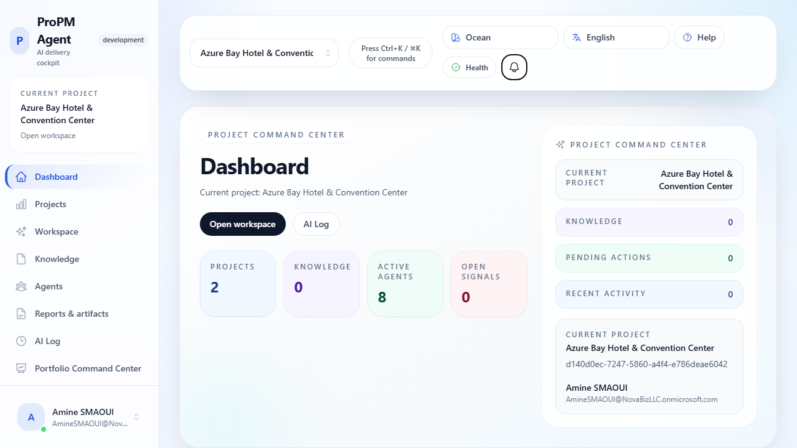

## Purpose

This page explains how ProPM Agent is organized and how to navigate the application efficiently.

## Why this matters

ProPM Agent is **project-scoped**. Picking the right project context is the difference between working with the correct knowledge base, agents, PM Docs, and AI Log.

## Who can use it

- **All signed-in users**

## Before you begin

- Sign in to ProPM Agent.

## How the shell works

### Left sidebar

Use the left sidebar as the main route map for the product:

- **Dashboard**: landing page and current readiness summary
- **Projects**: create, browse, and reopen project workspaces
- **Workspace**: project-scoped agent execution and follow-up actions
- **Knowledge**: project documents, upload, and search
- **Agents**: agent roster and custom-agent operations
- **PM Docs**: artifact library and review surfaces
- **AI Log**: run and event traceability
- **Portfolio Command Center**: cross-project comparison
- **Marketplace**: visible only to roles that can administer subscriptions

The active route is highlighted in the sidebar so you can confirm where you are immediately.

### Top bar

The top bar keeps the controls that change context or affect your entire session:

- **Project Switcher** changes the active project context.
- **Command palette** opens route search and quick navigation.
- **Theme** and **language** controls personalize the interface.
- **Health** shows app, auth, and realtime connectivity diagnostics.
- **Notifications** shows project and system events without interrupting navigation.

### Project-aware navigation

When you select a project in the **Project Switcher**, project-aware routes such as **Workspace**, **Knowledge**, **Agents**, **PM Docs**, and **AI Log** stay aligned to that project. Global routes such as **Projects**, **Portfolio Command Center**, and **Marketplace** stay global.

## Steps

1. Open **Dashboard** after sign-in.
2. Check the shell project context summary in the sidebar or top bar.
   - If it shows **All projects** or **Pick a project**, you are not yet working in a project-scoped surface.
3. Open the **Project Switcher** and choose a project.
4. Use the left sidebar to move to **Workspace**, **Knowledge**, **Agents**, **PM Docs**, or **AI Log**.
5. Open **Health** to confirm the app is connected and authenticated.
6. Open **Notifications** to review activity without losing your current page.
7. Use the command palette:
   - Press **Ctrl+K** (Windows) or **⌘K** (macOS)
   - Type a page name such as **Projects**, **Knowledge**, or **AI Log** and select it.
8. On mobile, use the menu button to open the sidebar and tap a destination.
   - The menu closes automatically after navigation.

## Expected results

- You can quickly switch projects and confirm you are working in the correct context.
- You can find core capabilities (Knowledge, Agents, PM Docs, AI Log) without searching.
- Project-aware pages stay aligned to the project you selected.
- Health and notification menus open without blocking normal navigation.

## Common issues

- **Marketplace is not visible in the menu**: Marketplace is only visible to users with specific admin roles.
- **A page says “Select a project first”**: select a project using the Project Switcher or open a project workspace from **Projects**.
- **You switched projects but landed on Workspace instead of staying on Projects**: this is expected when you choose a project from the switcher while you are on the global **Projects** directory, because the selected project opens directly into its workspace.
- **You expected Portfolio or Marketplace to become project-scoped**: those are global routes and intentionally do not keep a `projectId` in the URL.

## Tips

- Use **AI Log** when you need traceability (runs + activity timeline).
- Use **Dashboard** as the safest way to confirm both your route and your project context before starting work.
- Use **Export** on tables (when available) to download a CSV for offline review.

