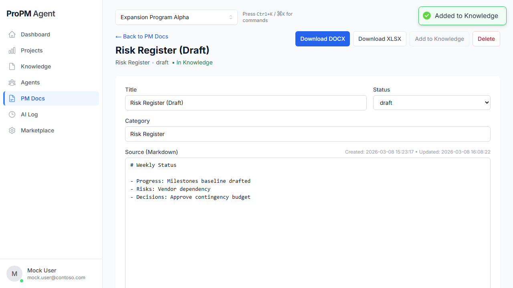

## Purpose

**PM Docs** is the structured artifact workspace for project documents created by agents and users. DOCX-ready content can be edited in Markdown, and XLSX files can be exported for local spreadsheet editing.

## Why this matters

PM Docs standardizes formal artifacts (charter, risk register, status output, decision note, update pack, and more) and keeps edits, status, review, and export actions inside the governed project context.

## Who can use it

- **View/download DOCX/XLSX:** all project members
- **Edit and add to Knowledge:** Project Owner, Project Manager, Contributor
- **Delete:** Project Owner, Project Manager

## Before you begin

- Select a project.
- Ensure PM Docs exist (seeded docs are provided in demo mode).
- For the demo path, use **Azure Bay Hotel & Convention Center** (`demo-hotel-001`) where seeded PM Docs are preloaded.

PM Docs may be created directly or generated from a structured run response through **Create draft** in the workspace.

## Steps

### Find and filter PM Docs

1. Open **PM Docs**.
2. Use filters (title/category/creator/status) and sorting to find the right document.

### Use seeded PM Docs in the default demo project

The default demo project includes pre-seeded PM Docs so you can demonstrate editing and export immediately. Typical seeded categories include:

- Project Charter
- Risk Register
- Communications Management Plan
- Status Report
- Test Plan
- Procurement Management Plan

### Edit a PM Doc

1. Select **Edit** on the row.
2. Update:
   - **Title**
   - **Status** (draft/final)
   - **Category**
   - **Source (Markdown for DOCX editing)**
3. Select **Save**.

> The web editor is for DOCX-ready content only. XLSX files are generated for download and should be edited locally on your computer.

### Review artifact metadata and lineage

When a PM Doc is linked to the artifact lifecycle, you may also see:

- artifact ID and version
- diff summary
- rendering profile
- source run ID
- lineage to structured output or context snapshot

Use this information when you need to explain how a stakeholder-facing output was produced.

### Approve or publish an artifact-backed PM Doc

If your deployment exposes artifact review actions:

1. Open the linked review surface.
2. Review **Preview**, **Diff**, and **Lineage**.
3. Approve the draft when it is ready.
4. Publish only to the configured internal or governed external destinations allowed by policy.

### Validate export payload after edit (recommended)

1. Add a unique marker line in **Source (Markdown)** (for example `EXPORT_VALIDATION_TOKEN_HOTEL_42`).
2. Save.
3. Download **DOCX** and **XLSX**.
4. Verify the exported file content includes the marker (engineering validation step used in demo automation).

### Export a DOCX

1. Select **Download DOCX**.
2. Save the file.

### Export an XLSX

1. Select **Download XLSX**.
2. Save the file.
3. Open the file locally in Excel or a compatible desktop spreadsheet app to continue editing.

### Add a PM Doc to Knowledge (optional)

1. Select **Add to Knowledge**.
2. Confirm the document shows **In Knowledge**.

## Expected results

- DOCX draft updates are saved.
- DOCX/XLSX exports download successfully.
- Added PM Docs can be treated as part of project Knowledge.
- Edited DOCX-ready content is reflected in exported DOCX/XLSX artifacts.
- Artifact-backed PM Docs can expose review, lineage, and publication posture.
- The default demo project already contains enough PM Docs to demonstrate filtering, editing, exporting, and add-to-Knowledge flows.

## Common issues

- **No PM Docs found**: your project may not have any PM Docs yet.
- **Add to Knowledge is disabled**: the PM Doc has already been added.
- **Delete fails**: your role may not allow deletion.

## Tips

- Use **final** status for documents that are ready for stakeholder distribution.
- Use **Add to Knowledge** to make key artifacts searchable.
- Treat approval and publication as explicit governance steps, not background automation.

