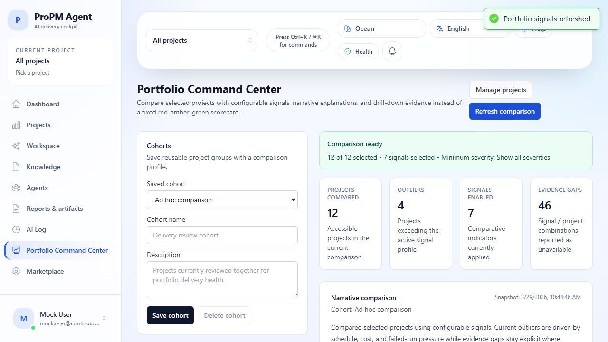
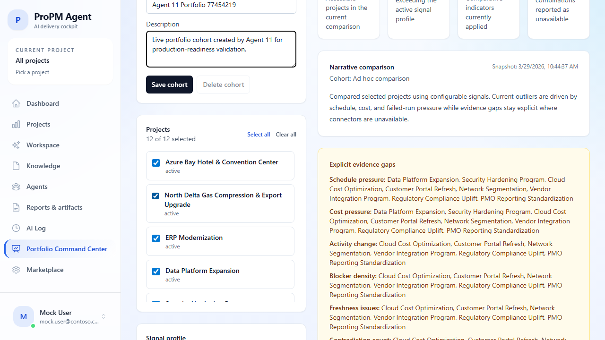

## Purpose

The **Portfolio Command Center** is the PMO cross-project comparison page. Use it when you need to compare several projects at once, save that comparison as a reusable cohort, tune which signals matter most, and drill directly into the project surface that needs action.

## Why this matters

Program and PMO leads need to identify outliers quickly, explain why a project stands out, and move from portfolio-level comparison to project-level execution with minimal friction.

## Who can use it

- **All signed-in users**

## Before you begin

- Sign in.
- Make sure you can access at least one project. The page can render without project access, but you will not be able to run a comparison until at least one project is selected.

## What you can do here

- Compare multiple projects at once
- Save a project set as a reusable **cohort**
- Re-open and update an existing cohort later
- Tune signal weights, thresholds, and minimum severity
- Refresh the latest comparison snapshot
- Expand a project to review narrative, recent activity, and evidence
- Jump directly into **Workspace**, **Knowledge**, **Agents**, **Reports & artifacts**, or **AI Log** for a specific project

## Build a comparison

1. Open **Portfolio Command Center** from the left navigation.
2. In **Projects**, either:
   - keep the currently selected projects,
   - select projects one by one,
   - choose **Select all**, or
   - choose **Clear all** and rebuild the comparison from scratch.
3. In **Signal profile**, enable only the signals you want to compare.
4. Adjust **Weight** when a signal should influence the portfolio score more or less heavily.
5. Adjust **Threshold** when a signal should trigger outlier behavior sooner or later.
6. Set **Minimum severity** if you want to hide low-priority signal noise.
7. Use **Reset defaults** to restore the default signal profile quickly.

## Save and manage cohorts

Use cohorts when you compare the same project group repeatedly, such as a weekly steering pack or a delivery watchlist.

1. In **Cohorts**, enter a clear cohort name.
2. Optionally add a short description that explains who should use it.
3. Select **Save cohort**.
4. To reopen a saved cohort later, choose it from **Saved cohort**.
5. Change the projects or signal profile, then select **Update cohort**.
6. Select **Delete cohort** when the saved group is no longer needed.

## Read the comparison output

1. Select **Refresh comparison** after you finish configuring the project set and signal profile.
2. Review the summary cards for the current snapshot.
3. Read the **Narrative comparison** to understand the current portfolio story in plain language.
4. Check the **Explicit evidence gaps** banner when a signal could not be calculated cleanly.
5. Review the **Outliers** section to see which projects exceeded the current profile.
6. Open **Show evidence & activity** on a project to inspect:
   - recent activity,
   - evidence references,
   - signal-by-signal reasoning,
   - the weighted score, and
   - project-aware shortcuts.

## Expected results

- Portfolio priorities are visible in one screen.
- Outlier reasoning stays evidence-backed instead of opaque.
- Signal gaps remain explicit instead of being hidden.
- You can jump from portfolio comparison to project execution in one click.

## Common issues

- **No accessible projects were returned**: your current account cannot access any projects in this environment. Use the Projects page to confirm access.
- **Refresh comparison stays disabled**: select at least one project, enable at least one signal, and keep weights and thresholds within the allowed range.
- **Portfolio comparison data is unavailable**: the page still supports cohort and signal configuration, but the backend snapshot or comparison service is not currently returning data.
- **Data appears stale**: select **Refresh comparison** and verify backend health if the snapshot still does not change.

## Tips

- Treat this page as the weekly PMO cockpit before governance or steering meetings.
- Keep one or two reusable cohorts for recurring operating rhythms, such as executive review, delivery watchlist, or recovery planning.
- If a project looks abnormal here, use the drill-down shortcuts immediately instead of searching for that project again in the sidebar.

