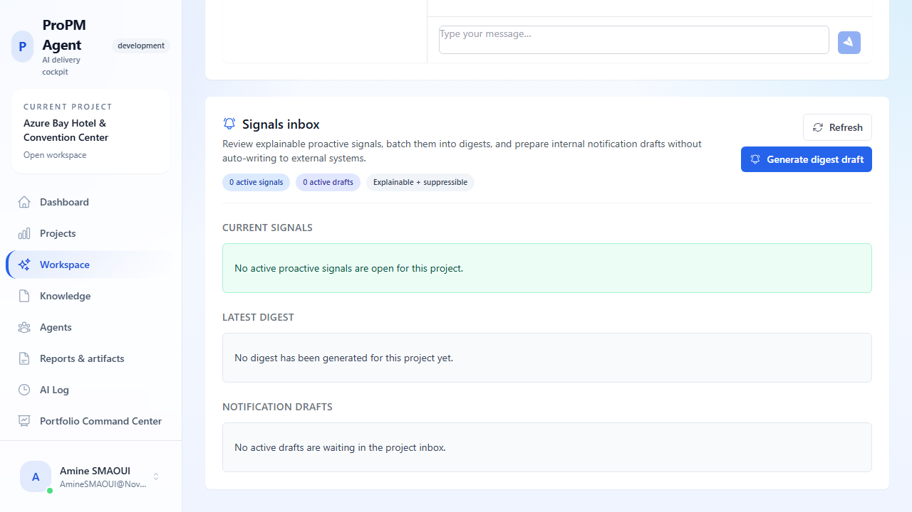

## Purpose

The **Project Workspace** is the operational center for one project. It combines conversational execution (agent chat) with project governance controls.

## Why this matters

Project-scoped work ensures traceability. Decisions, outputs, document categories, and role assignments remain attached to one project context.

## Who can use it

- **View workspace and run chats:** project members
- **Modify configuration tabs:** project members with the required permissions
- **Default demo project exception:** any signed-in user receives full project-admin rights in `demo-hotel-001`

## Before you begin

- You must have access to the target project.
- Open the project from **Projects**.
- For the demo storyline, use project **Azure Bay Hotel & Convention Center** (`demo-hotel-001`) which includes seeded chat sessions, seeded governance data, seeded PM Docs, seeded Knowledge documents, and seeded AI Log activity.

## Steps

### Run workspace chat

1. In **Workspace chat**, keep or choose an agent in the selector.
2. Enter a prompt in **Type your message…**.
3. Click **Send**.
4. Review the generated response and token/trace metadata when available.
5. (Optional) Click **Voice input** to use speech-to-text where supported by your browser.

### Use seeded chat history (demo project)

1. Open Workspace with project **Azure Bay Hotel & Convention Center**.
2. In the **Chats** panel, select a seeded conversation (for example **Hotel kickoff governance package** or **Construction risk review**).
3. Review the previous prompts and responses.
4. Click **New** to create another chat and send a new prompt.
5. Switch back to the seeded chat to demonstrate saved history.

### Configure project controls

1. Open tabs below chat:
   - **Agent configuration**
   - **Access control**
   - **Document categories**
2. Apply changes, then save.
3. Validate changes by reopening related screens (Agents, Knowledge, PM Docs).

In the default demo project, the current signed-in user automatically receives full rights. This lets you test all three administration tabs without first creating members or elevating roles.

Permission model:

- **Agent configuration** requires project permission `agent:configure`
- **Access control** uses `members:manage` and `roles:manage`
- **Document categories** requires `settings:manage`

## Expected results

- Chat responses are generated in project context.
- Configuration changes are persisted and visible across the project.
- The default demo project opens with full admin controls, seeded data, and ready-to-use walkthrough content.

## Common issues

- **Read-only state**: your project role does not include the required permission for that tab.
- **No agent response**: check health indicator and retry with a simpler prompt.
- **Voice button unavailable**: browser speech API is not available.

## Tips

- Start with **Virtual Project Manager** for multi-domain synthesis.
- Use specialist agents (Risk, Schedule, Governance, Finance, etc.) for deeper targeted output.
- Keep document categories curated; this improves PM Docs and Knowledge consistency.
- During demos, use seeded hotel chat sessions first, then create one new chat live to prove persistence and continuity.

