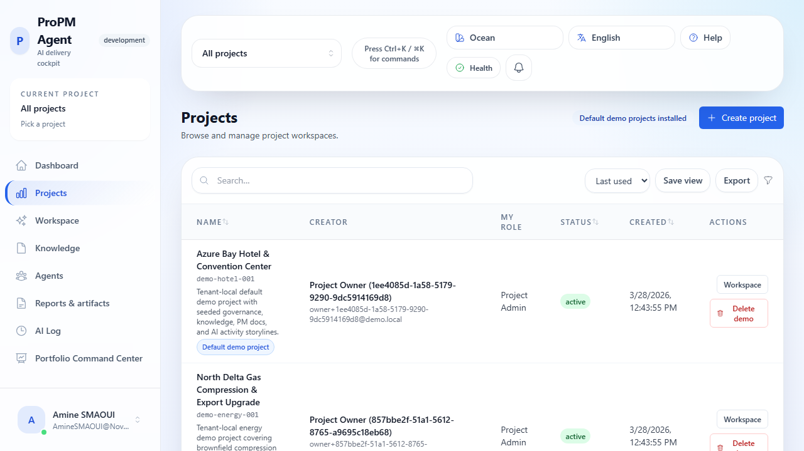
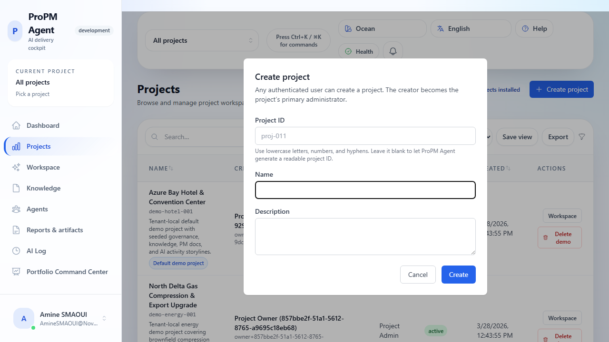
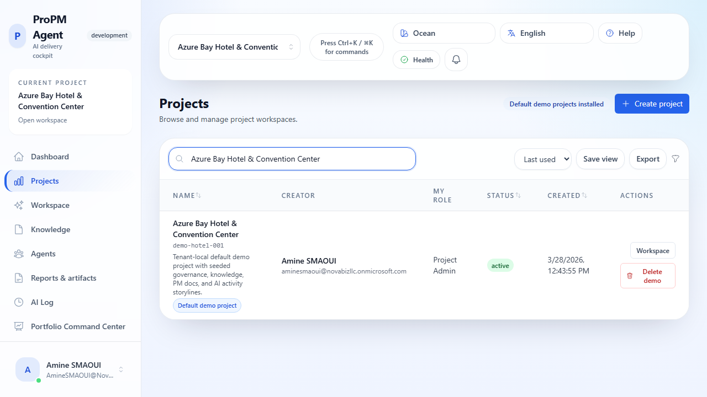

## Purpose

**Projects** is the directory for browsing, filtering, creating, reopening, restoring, and removing project workspaces.

## Why this matters

Every major workflow in ProPM Agent is project-scoped, including Workspace chat, Knowledge, PM Docs, signals, actions, governance, and AI Log. The **Projects** page is the safest place to confirm you are in the right project before you start work.

## Who can use it

- **Browse/open projects:** users with project access
- **Create projects:** any authenticated user

## Before you begin

- Sign in.
- The seeded hotel and energy demo projects are available by default for signed-in users. Use the restore action only if one of those demo projects has been removed from your view.

## What you can do from the Projects page

- **Browse the directory** of projects you can access
- **Search the directory** by project name, project ID, or description
- **Create a project** with only the required name field or with an explicit project ID
- **Open a workspace** directly from the project row
- **Restore the default demo projects** when one of the seeded demo workspaces has been removed
- **Delete a demo project** when you want to remove or reset a seeded environment

## Steps

### Browse and filter the project directory

1. Open **Projects**.
2. Use the search box above the table to narrow the list.
   - Search works best with project **name**, project **ID**, or distinctive words from the **description**.
3. Review the main columns:
   - **Name**
   - **Creator**
   - **My role**
   - **Status**
   - **Created**
4. Select **Workspace** in a row to open that project directly.

If your filter returns no matches, the page shows a clear empty state instead of leaving you wondering whether the table failed to load.

By default, signed-in users should see at least these seeded demo workspaces near the top of the directory:

- **Azure Bay Hotel & Convention Center**
- **North Delta Gas Compression & Export Upgrade**

### Create a project with the required fields only

1. Select **Create project**.
2. Enter a **Name**.
3. Leave **Project ID** empty if you want ProPM Agent to generate a readable project ID for you.
4. Leave **Description** empty or add one if it will help your team recognize the project later.
5. Select **Create**.
6. Confirm the app redirects you directly into the new workspace.
7. Confirm the workspace summary shows the generated **Project ID** and that the new project is now your active project context.

### Create a project with an explicit project ID

1. Select **Create project**.
2. Enter a **Project ID** if your team uses a naming convention such as `erp-modernization-2026`.
   - Use lowercase letters, numbers, and hyphens only.
3. Enter the required **Name**.
4. Optionally enter a **Description**.
5. Select **Create**.
6. Confirm the workspace summary shows your chosen **Project ID**.
7. Return to **Projects** and search for that project ID to confirm the directory shows it correctly.

The workspace URL uses the app's internal project context key. The **Project ID** shown in the Projects directory and workspace summary is the business-facing identifier your team should use.

### Confirm creator-admin behavior on a newly created project

After creating a project:

1. Return to **Projects**.
2. Search for the new project by name or project ID.
3. Confirm **My role** shows an admin-level role for the creator, such as **Project Owner** or **Project Admin**.
4. Reopen the workspace from the same row to confirm the app remembers that project context.

### Restore the default demo projects

1. In **Projects**, select **Restore demo projects** if one or more seeded demo projects are missing.
2. Wait for the success message and automatic redirect.
3. Confirm the restored workspace opens in the hotel demo environment.
4. Return to **Projects** and confirm both seeded demo rows are visible again:
   - **Azure Bay Hotel & Convention Center**
   - **North Delta Gas Compression & Export Upgrade**

### Open a seeded demo project

1. In **Projects**, search for **Azure Bay Hotel & Convention Center**.
2. Select **Workspace** in the project row.
3. Confirm the project is the seeded hotel demo by its name and demo badge.
4. Use this project for demos of chat history, structured outputs, evidence freshness, PM Docs editing/export, Knowledge flows, AI Log history, signals, governance tabs, and approval walkthroughs.

For portfolio and cross-project comparison walkthroughs, also open **North Delta Gas Compression & Export Upgrade** from the same directory.

### Use the multi-project comparison pack

Several synthetic projects are seeded alongside the hotel demo project so you can demonstrate portfolio comparison and evidence-backed outliers. Recommended comparison sets include:

- **Azure Bay Hotel & Convention Center** + **ERP Modernization** + **Data Platform Expansion**
- **Contact Center Upgrade** when you want a visibly higher schedule and cost pressure example
- **Security Hardening Program** when you want a lower-risk comparator

### Delete a demo project

1. In **Projects**, find the demo row you want to remove.
2. Select **Delete demo**.
3. Review the confirmation message carefully.
4. Confirm the delete action.
5. Verify that demo project disappears from the filtered list.
6. If one of the default demo rows is now missing, use **Restore demo projects** to bring the seeded demo set back.

If the demo project was your remembered current project, ProPM Agent clears that stale project context for you after the delete succeeds.

The Projects directory now shows the canonical seeded demo code for default demo rows, even when the backend stores a tenant-local internal project ID behind the scenes.

If you are running a local demo-mode build and want a fully clean reset, refresh the browser after re-importing so the latest seeded chats, documents, and PM Docs are loaded.

### Reopen a workspace later

1. Return to **Projects**.
2. Search for the project you want.
3. Select **Workspace**.
4. Confirm the page opens with the correct `projectId` in the URL.
5. Continue into Knowledge, PM Docs, AI Log, or other project-aware pages from that workspace context.

## Expected results

- Projects appear in the directory with enough detail to recognize them quickly.
- Search can narrow the directory by project name, project ID, or description.
- Workspace opens with the selected project context saved for later navigation.
- The creator receives project-admin access automatically for the new project.
- The default demo project set can be removed and restored without additional tenant setup.
- The hotel and energy demo projects are both available to signed-in users by default.
- Seeded comparison projects remain available for portfolio drill-down and outlier demonstrations.

## Common issues

- **No Create button**: you are not authenticated or the page failed to load correctly.
- **Cannot open project**: membership, role, or API access issue.
- **No Restore demo projects button**: the full seeded demo set is already available in your view.
- **Search returns no rows**: clear the search box and try a broader term such as part of the project name or project ID.
- **Delete demo does not appear**: only the default demo project exposes the demo delete action.

## Tips

- Apply consistent naming conventions (program prefix, geography, year).
- Include a short description so search results are easier to recognize later.
- For demos, use seeded project `Azure Bay Hotel & Convention Center` to showcase contextual outputs, artifacts, and approvals.
- Use the seeded comparison projects to demonstrate portfolio outliers, freshness drift, and contradictions.
- Use the demo-project import/delete cycle to reset walkthrough conditions before recordings or training sessions.
